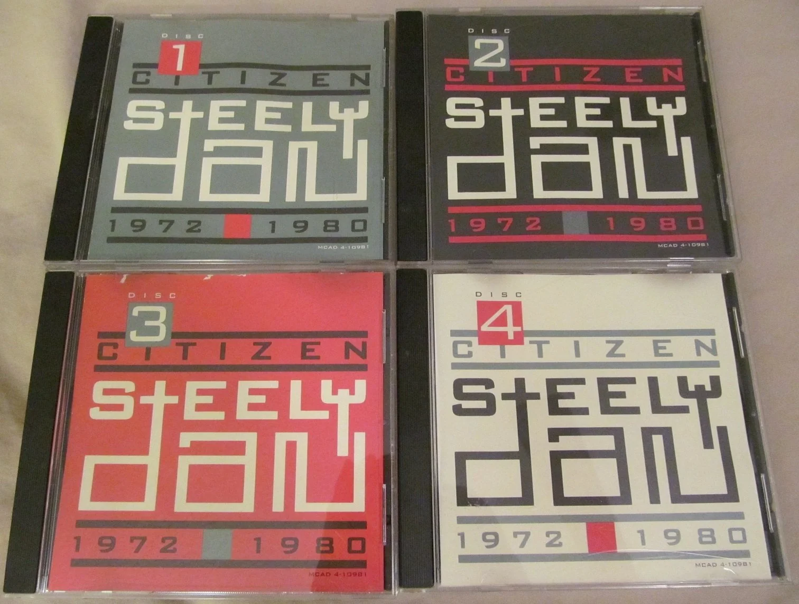

# Citizen Journalism

Citizen Journalism     
Citizen Journalist    
Citizen Journaling    
Citizen Journey    

"They’ve moved out of the society that would have protected them, and into the dark forest, into the world of fire, of original experience. Original **experience has not been interpreted for you**, and so you’ve got to work out your life for yourself. Either you can take it or you can’t. You don’t have to go far off the interpreted path to find yourself **in very difficult situations**. The courage to face the trials and to bring a whole new body of possibilities into the field of interpreted experience for other people to experience" - [Page 49. Year 1988.](https://books.google.com/books?id=2GOIGuh5GJ4C&pg=PA49&dq=%22whole+new+body+of+possibilities+into+the+field+of+interpreted+experience+for+other+people+to+experience%22&hl=en&newbks=1&newbks_redir=1&sa=X)

*Please help*.

&nbsp;

* Love your mama, love your brother, love them until they run for cover! Turn the light on. Keep your shirt on. https://www.youtube.com/watch?v=VxO0yuKWIF4 37,056 views December 4, 2018 Oh, Jesus! I'll keep my promise when... Please make mine *a double*, Sam! Stir it up nice... https://youtu.be/VxO0yuKWIF4?t=226 He's Here with ME AND YOU! We The People... TURN THAT HEARTBEAT OVER, AGAIN!

* “In 1964, long-playing vinyl records sounded great. It was the age of high fidelity, and even your parents were likely to have a good-sounding console or tube components and a nice set of speakers, A&R, KLH, and so on. All the telephones worked, and they sounded good, too. Rarely did anyone ever lose a call, and that was usually on an overseas line. Anyone could work a TV set, even your grandmother. Off, on, volume, change the channel, period. By then, just about everyone had an aerial on the roof, and the signal was strong: ten, twelve simple channels of programming, not all good, but lots of swell black-and-white movies from the thirties and forties, all day and most of the night. No soul-deadening porn or violence. Decent news programs and casual entertainment featuring intelligent, charming celebrities like Steve Allen, Groucho Marx, Jack Paar, Jack Benny, Rod Serling, and Ernie Kovacs. Yeah, call me old Uncle Fuckwad, I don’t care. William Blake’s “dark Satanic mills” of the industrial revolution may have enslaved the bodies of Victorian citizens, but **information technology is a pure mindfuck**. The TV Babies have morphed into the Palm People. For example, those people in the audience who can’t experience the performance unless they’re sending instant videos to their friends: Look at me, I must be alive, I can prove it, I’m filming this shit. You know what? I refuse to look at you. You’re a corpse. And you prove that every day, with everything you do and everything you say. **Wake up**, ya dope!” ― Donald Fagen (Steely Dan band leader), Eminent Hipsters

&nbsp;

&nbsp;

# 2026-01-16 Friday

https://MidWest.Social/post/41939835    
https://bsky.app/profile/roundsparrow.bsky.social/post/3mckj4zd4cc2u    
https://Autistics.Life/@RoundSparrow/115905694684522780    

&nbsp;

# 2026-01-23 Friday morning USA

https://autistics.life/@RoundSparrow/115944970231529157    
https://bsky.app/profile/roundsparrow.bsky.social/post/3md3x7fswlc2z    
https://MidWest.Social/post/42299746    

&nbsp;

# Sunday 2026-01-25

https://BSky.app/profile/roundsparrow.bsky.social/post/3mdbcmc75xs2p   
https://autistics.life/@RoundSparrow/115957044327641922

&nbsp;

# Wednesday January 28, 2026 Morning USA   

Originating   
"UnderReacting Opera"   
[/UnderReacting_Opera/UnderReacting_Opera.md](/UnderReacting_Opera/UnderReacting_Opera.md)    
